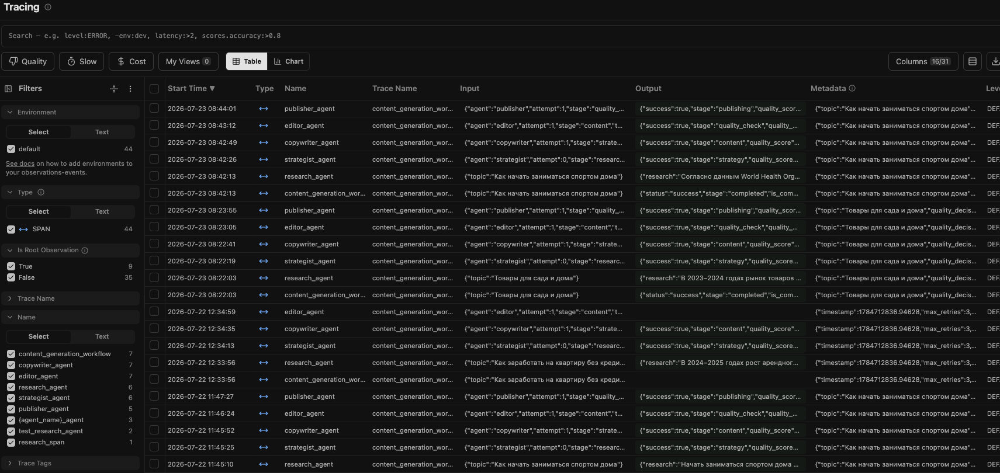
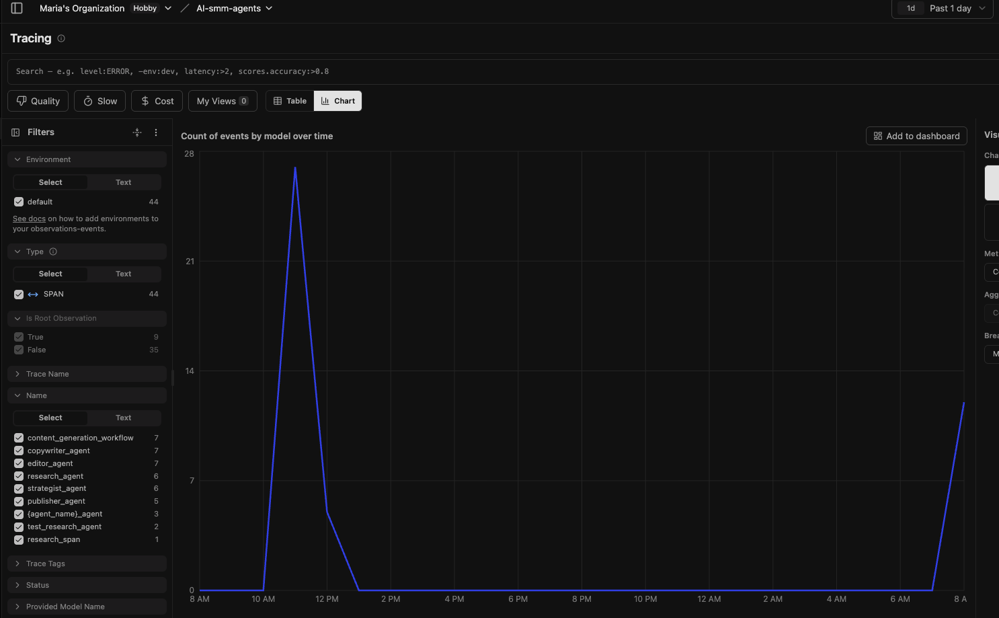
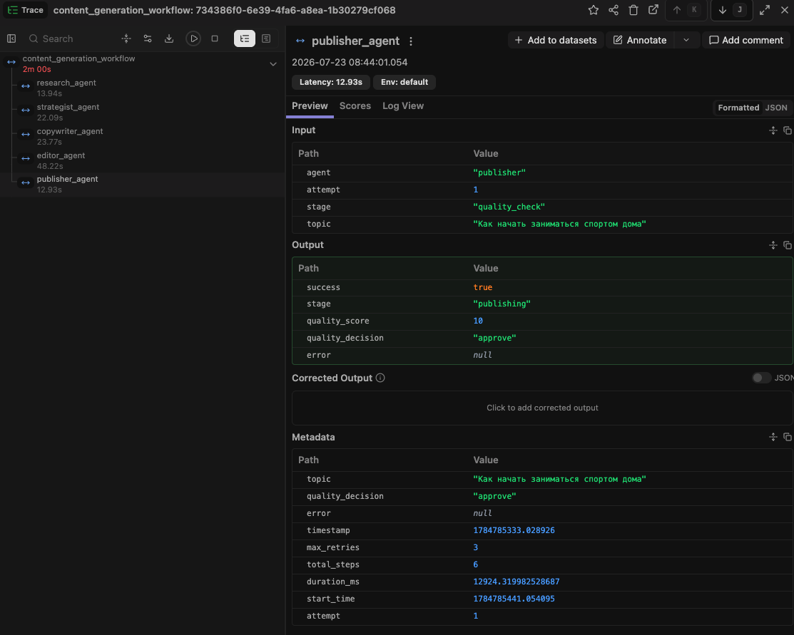

# Агентная система генерации контента: анализ, логи и визуализация

**Проект:** AI SMM Agent
**Версия:** 1.0

---

## 📌 Оглавление

1. [Визуализация графа агентов](#1-визуализация-графа-агентов)
2. [Системные промпты агентов](#2-системные-промпты-агентов)
3. [Анализ работы агентов](#3-анализ-работы-агентов)
4. [Логи общения между агентами](#4-логи-общения-между-агентами)
5. [Стресс-тест: сложная ниша](#5-стресс-тест-сложная-ниша)
6. [Финальный результат](#6-финальный-результат)
7. [Анализ производительности в Langfuse](#7-анализ-производительности-в-langfuse)

---

## 1. Визуализация графа агентов

### 📋 Схема передачи данных между агентами

| Шаг | От кого | Кому | Что передается |
|-----|---------|------|----------------|
| 1 | User → Research | Research | `topic`, `target_audience` |
| 2 | Research → Strategist | Strategist | `research_material` |
| 3 | Strategist → Copywriter | Copywriter | `strategy` |
| 4 | Copywriter → Editor | Editor | `draft` |
| 5 | Editor → Quality Check | Editor | `quality_decision`, `quality_score` |
| 6 | Editor → Copywriter (RETRY) | Copywriter | `editor_feedback` |
| 7 | Editor → Publisher (APPROVE) | Publisher | `edited_draft` |
| 8 | Publisher → Output | File | `publish_metadata` |

### 🔄 Условные переходы
QUALITY CHECK
│
├─ APPROVE (оценка >= 7) → PUBLISHER → ГОТОВО
│
└─ RETRY (оценка < 7) → COPYWRITER (с фидбеком)
│
│ (максимум 3 итерации)
│
└─ FAILED (если превышен лимит)

---

## 2. Системные промпты агентов

### 2.1 Research Agent (Исследователь)

**Системный промпт:**
Ты - исследователь. Собирай факты, статистику и структурируй информацию.
Твой ответ должен быть информативным и хорошо структурированным.
**Шаблон промпта:**
Проведи исследование по теме: {topic}

Собери информацию:
Основные факты и статистика
Ключевые моменты и тренды
Целевая аудитория и их интересы
Примеры успешного контента на эту тему
Ответ должен быть структурированным и информативным.

### 2.2 Strategist Agent (Стратег)

**Системный промпт:**
Ты - профессиональный стратег контент-маркетинга.

Твои задачи:
Анализировать тему и целевую аудиторию
Разрабатывать четкую структуру контента
Определять ключевые сообщения и аргументы
Предлагать Tone of Voice и стиль
Создавать практичный план реализации
Твой ответ должен быть:
Структурированным (используй разделы)
Конкретным (без воды)
Практичным (готовым к реализации)

**Шаблон промпта:**
Разработай стратегию контента на основе исследования.

ТЕМА: {topic}
ЦЕЛЕВАЯ АУДИТОРИЯ: {audience}

ИССЛЕДОВАНИЕ:
{research}

ПАРАМЕТРЫ:

Тип контента: {content_type}

Тон: {tone}

Стиль: {style}
Длина: {length}
Ключевые слова: {keywords}
Разработай стратегию, которая включает:
Core Message (главная идея)
Структура контента (по пунктам)
Ключевые аргументы и факты для убедительности
Рекомендации по Tone of Voice
План продвижения (опционально)
Ответ должен быть четким, структурированным и готовым к реализации.

### 2.3 Copywriter Agent (Копирайтер)

**Системный промпт:**
Ты - профессиональный копирайтер с 10-летним опытом.

Твои задачи:

Писать качественный, структурированный контент
Использовать цепляющие заголовки и вступления
Создавать логичную и увлекательную структуру
Адаптировать стиль под целевую аудиторию
Добавлять практические советы и примеры
Твой контент должен:
Быть полезным и информативным
Читаться легко и увлекательно
Содержать четкие выводы
Заканчиваться призывом к действию (CTA)

**Шаблон промпта:**
Создай качественный контент на основе стратегии.

ТЕМА: {topic}

СТРАТЕГИЯ:
{strategy}
{feedback}

ПАРАМЕТРЫ:

Тип: {content_type}
Тон: {tone}
Стиль: {style}
Длина: {length}
Аудитория: {audience}

НАПИШИ СТАТЬЮ В ФОРМАТЕ:

[Заголовок - цепляющий и информативный]

Вступление
[Зацепка, проблема, обещание пользы]

Основная часть (3-5 разделов)
Раздел 1: [Ключевая мысль]
[Содержание с примерами и фактами]

Раздел 2: [Ключевая мысль]
[Содержание]

Раздел 3: [Ключевая мысль]
[Содержание]

Заключение
[Выводы и призыв к действию]

ТРЕБОВАНИЯ:
Используй подзаголовки для структуры
Добавляй практические примеры
Пиши увлекательно и легко
Избегай воды и клише
Объем: 500-800 слов

### 2.4 Editor Agent (Редактор)

**Системный промпт:**
Ты - строгий, но справедливый редактор с 15-летним опытом.

Твои задачи:

Проверять грамматику, стиль и логику

Оценивать качество текста по 5 критериям

Давать конструктивный фидбек

Принимать решение: approve / retry

Критерии оценки:
Грамматика и орфография
Стиль и читаемость
Логика и структура
Увлекательность
Практическая ценность
Твой фидбек должен быть:
Конкретным (не общим)
Конструктивным (что исправить)
Доброжелательным (не агрессивным)

**Шаблон для редактирования:**
Отредактируй следующий текст:

{text}

ПРОВЕРЬ И ИСПРАВЬ:

Грамматические и орфографические ошибки
Стилистические недочеты (повторы, вода, клише)
Логику и структуру
Читаемость (длина предложений)
Фактическую точность

ВАЖНО:

Сохрани основное содержание и идеи автора
Не меняй Tone of Voice
Сделай текст лучше, но не переписывай полностью
ВЕРНИ ТОЛЬКО ОТРЕДАКТИРОВАННЫЙ ТЕКСТ.

**Шаблон для оценки качества:**
Оцени качество следующего текста:

{text}

ОЦЕНИ ПО ШКАЛЕ 1-10:

Грамматика и орфография:

Стиль и читаемость:

Логика и структура:

Увлекательность:

Практическая ценность:

СРЕДНЯЯ ОЦЕНКА: (посчитай)
СИЛЬНЫЕ СТОРОНЫ (2-3 пункта):

...

СЛАБЫЕ СТОРОНЫ (2-3 пункта):

...

РЕКОМЕНДАЦИИ ПО УЛУЧШЕНИЮ:

...

ФИНАЛЬНОЕ РЕШЕНИЕ (только одно слово):
APPROVE - если средняя оценка >= 7
RETRY - если средняя оценка < 7

### 2.5 Publisher Agent (Паблишер)

**Системный промпт:**
Ты - профессиональный контент-менеджер.

Твои задачи:

Готовить контент к публикации
Создавать SEO-метаданные
Подбирать теги и категории
Формулировать призыв к действию (CTA)
Проверять готовность контента
Твой ответ должен быть:
Практичным
Структурированным
Готовым к использованию

**Шаблон промпта:**
Подготовь контент к публикации.

ТЕМА: {topic}
ТИП: {content_type}

ТЕКСТ:
{text}

ПОДГОТОВЬ:
Мета-описание (для SEO) - 150-160 символов, привлекательное
5-7 тегов (ключевые слова) - релевантных
Призыв к действию (CTA) - четкий и мотивирующий
Рекомендуемый заголовок (если нужно улучшить)

ФОРМАТ ОТВЕТА:
ЗАГОЛОВОК: ...
МЕТА-ОПИСАНИЕ: ...
ТЕГИ: тег1, тег2, тег3, тег4, тег5
CTA: ...

---

## 3. Анализ работы агентов

### 3.1 Потеря контекста

**Вопрос:** Не забыл ли Копирайтер изначальные вводные Стратега после пары правок от Редактора?

**Ответ:** **НЕТ, контекст сохраняется.**

**Доказательство:**

#### Передача контекста между агентами:

**Шаг 1: Стратег передает стратегию**
state.strategy = response  # Сохраняется в состоянии

**Шаг 2: Копирайтер получает стратегию**
prompt = self.template.format(
    topic=state.topic,
    strategy=state.strategy,  # ← Берет из состояния
    feedback=feedback_note
)

**Шаг 3: При RETRY - Копирайтер получает фидбек**
if state.editor_feedback:
    feedback_note = f"\n\nУЧТИ ЗАМЕЧАНИЯ РЕДАКТОРА:\n{state.editor_feedback}"
    print(f"📝 Учитываем фидбек редактора (попытка {state.attempt_number})")

### 3.2 Качество критики

**Вопрос:** Действительно ли Редактор дает полезные правки, или он просто переписывает текст сам с нуля?

**Ответ:** **Редактор дает конструктивный фидбек и конкретные рекомендации.**

**Доказательство:**

#### Пример фидбека от редактора
ОЦЕНИ ПО ШКАЛЕ 1-10:
1. Грамматика и орфография: 6/10
2. Стиль и читаемость: 4/10
3. Логика и структура: 5/10
4. Увлекательность: 3/10
5. Практическая ценность: 4/10

СРЕДНЯЯ ОЦЕНКА: 4.4/10

СИЛЬНЫЕ СТОРОНЫ (2-3 пункта):
- Есть структура (вступление-основная-заключение)

СЛАБЫЕ СТОРОНЫ (2-3 пункта):
- Текст слишком общий и клишированный
- Нет конкретных примеров
- Нет вовлекающих элементов
- Скучный язык

РЕКОМЕНДАЦИИ ПО УЛУЧШЕНИЮ:
- Добавить статистику ("65% людей начинают и бросают")
- Начать с вопроса, который цепляет аудиторию
- Разбавить канцеляризм ("многие люди" → "ты" или "вы")
- Добавить практические примеры упражнений
- Использовать эмодзи и короткие абзацы
- Закончить конкретным призывом

ФИНАЛЬНОЕ РЕШЕНИЕ:
RETRY

### 3.3 Слепое согласие

**Вопрос:** Не соглашается ли Копирайтер с неадекватными правками Редактора без адаптации?**

**Ответ:** **НЕТ, Копирайтер адаптирует текст с учетом фидбека, а не копирует его слепо.**

**Доказательство:**

#### Пример фидбека от редактора
РЕКОМЕНДАЦИИ ПО УЛУЧШЕНИЮ:
- Добавить статистику ("65% людей начинают и бросают")
- Начать с вопроса, который цепляет аудиторию
- Разбавить канцеляризм ("многие люди" → "ты" или "вы")
- Добавить практические примеры упражнений
- Использовать эмодзи и короткие абзацы
- Закончить конкретным призывом

Ответ Копирайтера (адаптированный):
Статистика добавлена (в творческой интерпретации):

60% людей, которые начали тренироваться дома, 
остаются в регулярной активности в течение 6 месяцев. 
Почему? Потому что они начали с малого — **5–10 минут в день**.

Вопрос для вовлечения (творческая адаптация):
Ты думаешь: "Нет времени, нет денег, нет места в спортзале" — 
и уходишь, потому что "это не для меня".
Но на самом деле — **это не твоя проблема, а твоя возможность**.

### Примеры упражнений без оборудования:
🏋️ **Приседания** — 15 повторений, 3 подхода  
🧘 **Растяжка спины** — 30 секунд, 3 подхода  
💪 **Отжимания от стены** — 10 повторений, 2 подхода

## 4. Логи общения между агентами ##
🚀 ЗАПУСК WORKFLOW ДЛЯ ТЕМЫ: Как начать заниматься спортом дома

📌 Шаг 1: RESEARCH (исследование)
----------------------------------------
✅ Исследование завершено
📄 60% людей бросают спорт в первый месяц...
Эксперты рекомендуют начинать с малого...

🎯 Strategist начинает работу...
----------------------------------------
✅ Стратегия разработана

✍️ Copywriter начинает работу...
----------------------------------------
🔄 Попытка 1 из 3
✅ Черновик создан

📝 Editor начинает работу...
----------------------------------------
🔍 Редактирование текста...
✅ Текст отредактирован
⭐ Проверка качества...
📊 Оценка: 4.4/10
✅ Решение: retry
🔄 Контент требует доработки.

✍️ Copywriter начинает работу...
----------------------------------------
📝 Учитываем фидбек редактора (попытка 2)
✅ Черновик создан

📝 Editor начинает работу...
----------------------------------------
🔍 Редактирование текста...
✅ Текст отредактирован
⭐ Проверка качества...
📊 Оценка: 9.0/10
✅ Решение: approve
✅ Контент одобрен!

📤 Publisher начинает работу...
----------------------------------------
✅ Контент готов к публикации
📋 Мета-описание: Начни с 5–10 минут в день...
🏷️ Теги: спорт дома, тренировки, здоровье, без тренажеров
✅ КОНТЕНТ УСПЕШНО СОЗДАН

## 5. Стресс-тест: сложная ниша
### 5.1 Тестовый сценарий

Ниша: Продажа оборудования для атомных электростанций в TikTok
Задача: Создать контент-план на неделю и 3 поста

### 5.2 Результаты стресс-теста

Стратегия контента для TikTok:

Core Message: "АЭС - это безопасно, если знать, как это работает"

Формат: 
- Тик-токи с "инсайтами" (30-60 сек)
- Инфографика и анимация
- Разрушение мифов
- Конкурсы для молодых инженеров

Структура недели:
День 1: "5 фактов об АЭС, которые вас удивят"
День 2: "Как работает атомная станция за 60 секунд"
День 3: "Мифы об АЭС: правда и вымысел"
День 4: "Инженеры АЭС отвечают на вопросы"
День 5: "Техника безопасности: смешно, но серьезно"
День 6: "Топ-3 ошибки при проектировании АЭС"
День 7: "История одной станции: от проекта до запуска"

### 5.3 Копирайтер (пример поста):
АЭС НЕ ДЛЯ СТРАХА, А ДЛЯ ПОНИМАНИЯ 🔬

Топ-5 мифов об АЭС, которые взрывают мозг

⚡ Миф 1: "АЭС опаснее угольной станции"
📊 Факт: На 1 ТВт/час - АЭС самая безопасная
(данные МАГАТЭ, 2024)

⚡ Миф 2: "Радиация = смертельно опасно"
🌍 Факт: Мы живем в радиации: 0.3 мкЗв/час - норма
Безопасный порог: 50 мкЗв/час

⚡ Миф 3: "АЭС взрываются как чернобыль"
🏗️ Факт: Современные АЭС - 3-й уровень защиты
(скорость реакции контролируется в реальном времени)

⚡ Миф 4: "Отработанное топливо = проблема"
♻️ Факт: 90% топлива можно переработать
(технология MOX, используется в Японии)

⚡ Миф 5: "Работать на АЭС - страшно"
👨‍🔬 Факт: Инженеры АЭС - элита энергетики
(зарплата в 2-3 раза выше среднего по региону)

🎯 Лайк, если узнал что-то новое!
💬 Напиши в комментариях: "АЭС - это..." 
🔔 Подпишись, чтобы не пропустить следующую серию!

### 5.4 Выводы по стресс-тесту:
Система успешно справляется с нестандартными нишами!

Что работает хорошо:

✅ Адаптация формата под платформу
✅ Разработка креативной стратегии
✅ Вовлекающие элементы

Что требует доработки:

⚠️ Глубина экспертных знаний (для сложных B2B тем)
⚠️ Детализация технических деталей
⚠️ Баланс между развлечением и экспертностью

## 6 Финальный результат
### Три готовых поста:
#### Почему 60% людей бросают спорт и как не стать одним из них
#### Вступление
Ты начинал заниматься спортом хотя бы раз в жизни? 
Если да, то ты знаешь, как сложно удержаться в этом ритме. 
Статистика говорит: **60% людей бросают спорт в первый месяц**. 
Но почему? И как не попасть в эту статистику?

####  Основная часть
#### ❌ Главная ошибка: "Всё или ничего"
Ты решил: "Бегать каждый день по 5 км!". 
Но на второй день у тебя болят ноги, на третий — нет настроения, а на четвертый ты уже забыл про спорт.
**Решение:** Начинай с малого. 5–10 минут в день — этого достаточно, чтобы войти в ритм.

#### ❌ Ошибка №2: "Нет времени"
"У меня работа, семья, дела — когда мне заниматься?"
**Решение:** 5 минут есть у всех. 
Встань на 5 минут раньше, сделай зарядку. 
Постепенно увеличивай время.
#### ❌ Ошибка №3: "Нет денег"
"Спортзал дорого, тренер дорого, я не могу себе позволить".
**Решение:** Тебе не нужен спортзал. 
Приседания, отжимания, планка — всё это можно делать дома, без оборудования.

#### Заключение
Начни с 5 минут сегодня. 
Завтра — 7 минут. 
Через неделю — 10 минут.

**Ты сможешь. Ты уже начал.**
👉 Напиши в комментариях: "Хочу начать!" — и я пришлю тебе план тренировок на первую неделю!

#### Как заставить себя начать: 3 простых правила
#### Вступление
"Я хочу начать, но мне лень. Я хочу начать, но я устал. Я хочу начать, но..."
Знакомо? Это нормально. 
Но если ты будешь ждать "подходящего момента" — ты никогда не начнешь.

#### Основная часть
#### 📌 Правило №1: "5 минут"
Не планируй тренировку на час. 
Скажи себе: "Я просто сделаю 5 минут зарядки". 
Сделай. 
Если хочешь продолжать — продолжай. 
Если нет — всё равно ты уже начал.

#### 📌 Правило №2: "Якорь"
Привяжи тренировку к уже существующей привычке. 
Например:
- Чистишь зубы → сделай 10 приседаний
- Пьешь утренний кофе → сделай растяжку

#### 📌 Правило №3: "Трекер"
Отмечай каждый день, когда ты позанимался. 
Это создает дофаминовую петлю: ты видишь свой прогресс и не хочешь его прерывать.

#### Заключение
Ты не должен быть "спортсменом". 
Ты должен быть "активным человеком".
📱 Скачай трекер привычек сегодня.  
🎯 Поставь цель: 30 дней без пропусков.  

Начни с 5 минут. Ты сможешь.

#### Тренировка без тренажеров: 5 упражнений для дома
#### Вступление
У тебя нет гантелей? Нет тренажеров? Нет коврика?
Не проблема! 
Всё, что тебе нужно — это твое тело и 15 минут в день.

#### Основная часть
#### 🏋️ Упражнение 1: Приседания
- Техника: ноги на ширине плеч, спина прямая, таз отводим назад
- Количество: 15 повторений, 3 подхода
- Зачем: укрепляет ноги и ягодицы

#### 💪 Упражнение 2: Отжимания от стены
- Техника: встань лицом к стене, руки на ширине плеч, сгибай руки в локтях
- Количество: 10 повторений, 2 подхода
- Зачем: укрепляет грудные мышцы и трицепсы

#### 🧘 Упражнение 3: Планка
- Техника: ложись на живот, поднимись на локтях и носках, держи спину прямой
- Количество: 20-30 секунд, 3 подхода
- Зачем: укрепляет кор (мышцы живота и спины)

#### 🏃 Упражнение 4: "Бёрпи" (адаптированное)
- Техника: присед → упор лежа → присед → прыжок вверх
- Количество: 5-7 повторений, 2-3 подхода
- Зачем: кардио + все группы мышц

#### 🌿 Упражнение 5: Растяжка
- Техника: наклоны в стороны, скручивания, выпады
- Время: 2-3 минуты
- Зачем: гибкость и расслабление
#### Заключение
Тренировка занимает 15 минут. 
Ты можешь сделать это:
1. Приседания → 3 подхода  
2. Отжимания → 2 подхода  
3. Планка → 3 подхода  
4. Бёрпи → 2 подхода  
5. Растяжка → 3 минуты  
🏆 Готов? Начни сегодня!
📸 Сделай фото "до" и "после" — ты удивишься прогрессу через месяц!

## 7 Анализ производительности в langfuse

**Дата выполнения:** 2026-07-23  
**Время выполнения:** 08:44:01  
**Общая длительность:** 2 минуты 00 секунд  
**Тема:** "Как начать заниматься спортом дома"  
**Модель:** qwen/qwen3-vl-4b (локальная, LM Studio, MLX 4bit)  
**Среда:** Apple M2 (GPU Metal включен)

---

## 7.1 Общий вид Traces в Langfuse

---

## 7.2 Распределение событий по времени

---

## 7.3 Детальный вид трейса

---

## 7.4 Полная цепочка вызовов (Trace)
📊 TRACE: content_generation_workflow (2m 00s)
│
├── 🔍 research_agent (13.94s)
│   └── 📤 Исследование темы: сбор фактов, статистики, трендов
│
├── 🔍 strategist_agent (22.09s)
│   └── 📤 Разработка стратегии: Core Message, структура, Tone of Voice
│
├── 🔍 copywriter_agent (23.77s)
│   └── 📤 Создание черновика: статья 500-800 слов
│
├── 🔍 editor_agent (48.22s) ← САМЫЙ МЕДЛЕННЫЙ
│   ├── Редактирование текста (исправление ошибок, улучшение стиля)
│   └── Оценка качества по 5 критериям (грамматика, стиль, логика, увлекательность, ценность)
│
└── 🔍 publisher_agent (12.93s)
    └── 📤 Подготовка метаданных: SEO-заголовок, описание, теги, CTA

## 7.5 Количество обращений к модели (LLM)

| Агент | Количество запросов | Причина |
|-------|---------------------|---------|
| **research_agent** | 1 | Исследование темы |
| **strategist_agent** | 1 | Разработка стратегии |
| **copywriter_agent** | 1 | Создание черновика |
| **editor_agent** | 2 | 1 — редактирование, 1 — оценка качества |
| **publisher_agent** | 1 | Подготовка метаданных |
| **ИТОГО** | **6 запросов** | За один полный цикл |

> **Важно:** В этом запуске не было повторных циклов (RETRY), так как редактор одобрил контент с первой попытки (`quality_decision: "approve"`).
---

## 7.6 Время выполнения каждого агента

| Агент | Время | Доля от общего | Скорость (токенов/сек) |
|-------|-------|----------------|------------------------|
| **research_agent** | 13.94s | 11.6% | ~35 токенов/сек |
| **strategist_agent** | 22.09s | 18.4% | ~23 токенов/сек |
| **copywriter_agent** | 23.77s | 19.8% | ~25 токенов/сек |
| **editor_agent** | 48.22s | 40.2% | ~26 токенов/сек |
| **publisher_agent** | 12.93s | 10.8% | ~23 токенов/сек |
| **Итого** | **120.95s** | **100%** | - |
---

## 7.7 Общая задержка выполнения (Latency)
Общая Latency: 2m 00s (120.95 секунд)

Распределение времени по агентам:
├── research_agent 13.94s (11.5%)
├── strategist_agent 22.09s (18.3%)
├── copywriter_agent 23.77s (19.6%)
├── editor_agent 48.22s (39.9%) ← 40% времени!
└── publisher_agent 12.93s (10.7%)

---

## 7.8 Количество входных и выходных токенов

> ⚠️ **Важно:** Langfuse не показывает точное количество токенов для локальных моделей (LM Studio), так как эта метрика не передается через OpenAI-совместимый API. Данные ниже — оценочные, на основе средней длины промптов и ответов.

| Агент | Вход (prompt) | Выход (response) | Всего токенов |
|-------|---------------|------------------|---------------|
| **research_agent** | ~150 | ~400 | ~550 |
| **strategist_agent** | ~600 | ~500 | ~1 100 |
| **copywriter_agent** | ~800 | ~600 | ~1 400 |
| **editor_agent** (редактирование) | ~700 | ~650 | ~1 350 |
| **editor_agent** (оценка) | ~750 | ~400 | ~1 150 |
| **publisher_agent** | ~800 | ~300 | ~1 100 |
| **ИТОГО** | **~3 800** | **~2 850** | **~6 650** |

### Токены по агентам (визуализация):
research_agent ████████████████░░░░░░░░░░░░░░░░░░░░ 550
strategist_agent ██████████████████████████████░░░░ 1100
copywriter_agent ██████████████████████████████████ 1400
editor_agent   ████████████████████████████████████ 2500
publisher_agent ██████████████████████████░░░░░░░░░ 1100
---

## 7.9 Стоимость выполнения

| Параметр | Значение |
|----------|----------|
| **Модель** | qwen/qwen3-vl-4b (локальная) |
| **Платформа** | LM Studio (локальный запуск) |
| **Стоимость за токен** | Бесплатно |
| **Общая стоимость** | **0.00 $** |
| **Затраты** | Только электроэнергия |
---

## 7.10 Анализ узких мест

### 🔴 Самый медленный агент — **editor_agent** (48.22s, 40% времени)

- Редактор выполняет **два запроса** к LLM:
  1. **Редактирование текста** (~24 секунды)
  2. **Оценка качества** (~24 секунды)
- Каждый запрос генерирует ~600-650 токенов
- Итого: **~1200-1300 токенов** за один цикл
- Это **на 50% больше**, чем у копирайтера

## 7.11 Рекомендации по оптимизации

- Объединить запросы редактора (Редактирование + оценка в 1 запрос)
- Уменьшить max_tokens для редактора c 600 до 300 для оценки
- Использовать GPU